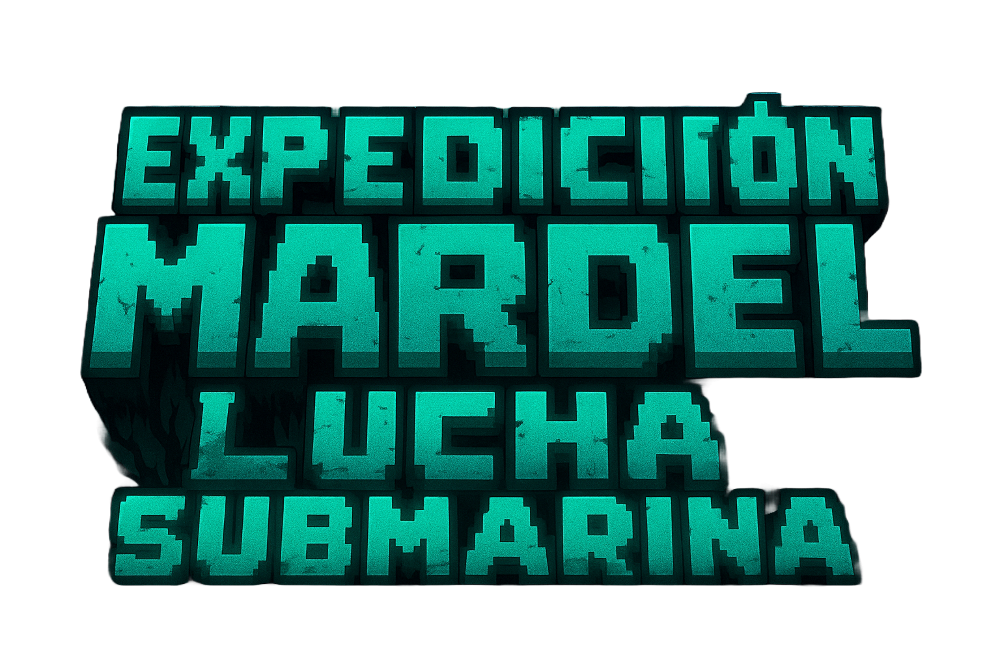

# La Expedición 🗺️ - Una Aventura Submarina 🌊 Retro 👾


<p align="center">
  
</p>

<p align="center">
  <a href="https://hectordanielayarachifuentes.github.io/expedicion-submarina/">
    
  </a>
</p>

<p align="center">
  
  
  
</p>

¡Sumérgete en las profundidades desconocidas en **La Expedición**! Un shooter arcade retro de desplazamiento lateral donde pilotas el submarino 'Subastian' a través de peligrosos cañones y fosas abisales. Captura especímenes exóticos, enfréntate a criaturas marinas hostiles y derrota a jefes colosales en esta emocionante aventura pixelada.

---

## 🚀 Galería de la Misión

| El Comienzo de la Aventura | Un Ecosistema Hostil |
| :-------------------------: | :-----------------------: |
|  |  |
| *El viaje comienza. ¡Prepárate para sumergirte!* | *Las profundidades están llenas de vida... y no toda es amigable.* |
| **Escenarios Desafiantes** | **Ascenso Desesperado** |
|  |  |
| *Navega por cañones traicioneros y campos de escombros.* | *Escapa de un colapso inminente en un frenético ascenso vertical.* |
| **Gigantes del Océano** | **Depredadores Alfa** |
|  |  |
| *Encuéntrate con majestuosas ballenas. ¿Serán aliadas o adversarias?* | *Cuidado con los tiburones que acechan en la oscuridad.* |
| **Jefes Legendarios** | **El Caos Personificado** |
|  |  |
| *Enfréntate a leyendas antiguas. El Kraken te espera en su guarida.* | *Sobrevive al encuentro con el demencial Jefe Mierdei.* |


## ✨ Características Principales

- **9 Niveles Desafiantes:** Viaja a través de diversos escenarios con objetivos variados: captura de especímenes, supervivencia por tiempo y épicas batallas contra jefes.
- **Arsenal Versátil:** Equipa tu submarino con 4 armas principales (Garfio de captura, Escopeta, Metralleta, Láser de energía) y torpedos secundarios.
- **Habilidades Especiales:** Utiliza un impulso de velocidad para esquivar peligros o posicionarte estratégicamente.
- **Sistema de Partículas Dinámico:** Sumérgete en un mundo vivo con efectos de burbujas, explosiones, humo, estelas de proyectiles y efectos de armas.
- **Inmersión Profunda:** Fondos con efecto de paralaje y una atmósfera que se oscurece a medida que desciendes.
- **IA Enemiga Compleja:** Enfréntate a una fauna diversa, desde peces pasivos hasta tiburones cazadores y ballenas con múltiples patrones de ataque.
- **Jefes Memorables:** Lucha contra el temible Kraken, el caótico Jefe Mierdei y otros peligros que acechan en las profundidades.
- **Progreso Guardado:** El juego guarda tu puntuación máxima y el nivel más alto desbloqueado en tu navegador usando `localStorage`.
- **Controles Flexibles:** Juega con teclado en el escritorio o con controles táctiles optimizados en dispositivos móviles.

## 🕹️ Cómo Jugar

| Acción | Teclado |
| :--- | :---: |
| **Mover Submarino** | `↑` `↓` `←` `→` |
| **Disparar Arma Principal** | `Barra Espaciadora` |
| **Lanzar Torpedo** | `X` |
| **Cambiar de Arma** | `C` |
| **Activar Impulso** | `B` |
| **Pausa / Menú** | `Esc` |

## 🛠️ Tecnologías Utilizadas

Este juego fue construido desde cero, sin depender de librerías o motores de juego externos, para demostrar un profundo conocimiento de las tecnologías web fundamentales.

- **HTML5:** Se utiliza para la estructura semántica del juego y la interfaz de usuario (HUD, menús, overlays).
- **CSS3:** Responsable de todos los los estilos de la interfaz, las animaciones de los menús y los efectos visuales como `backdrop-filter` para el desenfoque del HUD. El diseño es responsivo y se adapta a diferentes resoluciones.
- **JavaScript (ES6+ Vanilla):** Es el corazón y el cerebro del juego.
  - **Motor de Juego Personalizado:** Toda la lógica de renderizado, bucle de juego, gestión de estado, física y detección de colisiones está implementada en JavaScript puro.
  - **API de Canvas 2D:** Se utilizan múltiples capas de `<canvas>` para renderizar el fondo, las entidades del juego, los efectos de partículas y el HUD de forma optimizada.
  - **Módulos ES6:** El código está organizado en un sistema modular (`game.js`, `levels.js`, `levelX.js`) que encapsula la lógica, mejora la legibilidad y facilita el mantenimiento.
  - **Programación Orientada a Objetos:** Se emplean objetos y patrones de singleton para gestionar entidades (jugador, enemigos, proyectiles) y sistemas globales como el audio.
  - **Fetch API:** Se usa para cargar de forma asíncrona los datos de los *spritesheets* (archivos `.json`) que definen las animaciones.

## 📂 Estructura del Proyecto

El proyecto está organizado de manera lógica para separar las responsabilidades:

```
expedicion-submarina/
├── css/
│   └── style.css         # Estilos de la UI y el juego
├── img/
│   ├── Fondos/
│   ├── sprites/
│   └── ...               # Recursos gráficos
├── js/
│   ├── game/
│   │   └── game.js       # Motor principal del juego (core)
│   ├── json_sprites/
│   │   └── ...           # Datos de los spritesheets
│   ├── levels/
│   │   ├── level1.js     # Lógica específica de cada nivel
│   │   └── levels.js     # Gestor y cargador de niveles
│   ├── main.js           # Punto de entrada de la aplicación
│   └── ...
├── sonidos/
│   └── ...               # Efectos de sonido y música
├── index.html            # Estructura principal del juego
└── README.md             # ¡Estás aquí!
```

## 💻 Cómo Ejecutar Localmente

1.  Clona el repositorio:
    ```bash
    git clone https://github.com/HectorDanielAyarachiFuentes/expedicion-submarina.git
    ```
2.  Navega al directorio del proyecto:
    ```bash
    cd expedicion-submarina
    ```
3.  Abre el archivo `index.html` en tu navegador web.
    > **Nota:** Para una mejor experiencia y para evitar posibles problemas de CORS al cargar recursos locales, se recomienda usar un servidor web simple como la extensión Live Server para Visual Studio Code.

## 👨‍💻 Creador

**Hector Daniel Ayarachi Fuentes**
- GitHub: @HectorDanielAyarachiFuentes

---

*¡Gracias por jugar y explorar las profundidades!*
